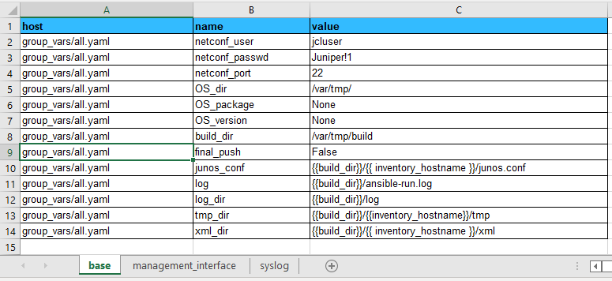
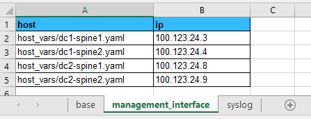
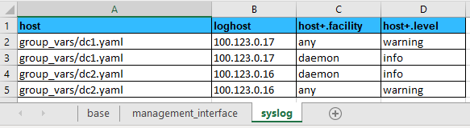

# NAME

Projects. What you need to know to create your own projects in NITA.

# DESCRIPTION

NITA ships with two example projects that we use to demonstrate its ability to automate the build and test processes for both an [EVPN VXLAN data centre using Juniper QFX devices](https://github.com/Juniper/nita-webapp/tree/22.8/examples/evpn_vxlan_erb_dc) and a simple [DC WAN topology based on IPCLOS and eBGP](https://github.com/Juniper/nita-webapp/tree/22.8/examples/ebgp_wan). However, what if we wanted to configure it to do something else? This document explains how to do just that.

# EXAMPLE

## Start With the Device Inventory

Let's use the same [EVPN VXLAN example from the NITA webapp repo](https://github.com/Juniper/nita/tree/main/examples/evpn_vxlan_erb_dc), where we had already defined two data centres, ``dc1`` and ``dc2``. For simplicity, let's assume that we want to configure the spine devices in those two data centres, which we will place into two groups with those names. The groups are also Ansible roles, and will help us when instructing Ansible as to what devices to work on. We can write this down as an Ansible inventory using the Ansible [INI](https://docs.ansible.com/ansible/latest/user_guide/intro_inventory.html) format, like this:

```shell
[all:children]
dc1
dc2

[dc1]
dc1-spine1
dc1-spine2

[dc2]
dc2-spine1
dc2-spine2
```

Save this file and call it ``hosts``. You will need to give to the NITA webapp later, when you upload your project.

Now, let's say that spine devices in ``dc1`` should have one standard config, and spine devices in ``dc2`` should have another.

## Junos Commands and Templates

Now let's think about the configurations needed for each device and let's standardise them by using a template. Templates make your life easier and make troubleshooting simpler because everything should be stardard and consistent. For this example, let's say that we want to configure syslog so that certain types of message are forwarded to a named loghost. In ``dc1`` we will send messages to the loghost at ``100.123.0.17`` and in ``dc2`` we will send messages to the loghost at ``100.123.0.16``. We will configure all spine devices so that messages from ``any`` facility that are of the ``warning`` severity or above and messages from the  ``daemon`` facility at ``info`` level or above are forwarded to the appropriate loghost.

If we were using the Junos CLI, the commands to enter would look something like this:

```shell
dc1-spine1# set system syslog host 100.123.0.17 any warning
dc1-spine1# set system syslog host 100.123.0.17 daemon info
```

which would render into a Junos configuration like this:

```shell
host 100.123.0.17 {
    any warning;
    daemon info;
}
```

Now we need to create a [Jinja2 template](https://jinja.palletsprojects.com) that can render this configuration snippet using inventory data that will be provided by NITA. For this example, we will use the following template:

```jinja
{# Template for Junos syslog configuration #}

system {
  syslog {
    
        host {{ base.syslog.loghost }} {
    
    
      
          {{ row.facility }} {{ row.level }};
      
        }
    
    
        host {{ syslog.loghost }} {
        
          {{ row.facility }} {{ row.level }};
        
        }
    
  }
}
```

This template will need to be provided along with your project files, which are explained in the [Project Files](#project-specific-files) section below.

## Inventory Data

The last part that we need to focus on relates to the actual values that will be used by NITA to populate the templates and convert them into actual device configurations. It can get pretty big, so for this example we will use spreadsheets (everybody does, right?!). NITA will need three different types of data, so we will use three different worksheets in a single Excel workbook:

### Base Data

Let's start with some base information that NITA uses. You can think of these a bit like global variables. The spreadsheet needs to have three columns named ``host``, ``name`` and ``value``, like this:



The ``host`` column is actually a filename where the information will be stored and the other two columns are attribute/value pairs. Probably the most important A/V pairs here relate to the netconf user, password and port number, which NITA will use when communicating with devices. Make sure they are correct for your environment

### Management Interface Data

The next sheet contains two columns that specify the Ansible file and IP addresses for each of the spine devices you want to configure:



The YAML files themselves are created by NITA later in the process, you don't need to create them.

### Syslog Data

The final worksheet contains the actual information for the syslog Jinja2 template that was [outlined above](#junos-commands-and-templates):



As you can see, there are four columns in this sheet. The first column contains the Ansible file for the appropriate group (``dc1`` or ``dc2``), the second contains the IP address for the syslog ``loghost`` and the last two columns hold the values for the syslog ``facility`` and ``level``.

:warning: Note that the names for the last two columns both contain the "+" symbol, i.e. ``host+.facility`` and ``host+.level``. Because there are multiple rows (i.e. values) with the same attribute (in this case, the loghost) it is necessary to tell NITA to treat these fields as ordered dictionaries instead of strings. You do that by using the "+" nomenclature as shown here. It is important to be aware of this, should you wish to parse similar data types yourself later.

## Building a Project Zip File

You upload your project data to the NITA Webapp as a zip file, which contains all of the playbooks and scripts that you need. Let's look at creating a zip file for the syslog example above.

### Standard Files

To begin with, there are some standard files that we recommend go into every project zip file and rather than reinvent the wheel, we recommend that you download them from either the [EVPN VXLAN](https://github.com/Juniper/nita/tree/main/examples/evpn_vxlan_erb_dc) or [eBGP WAN](https://github.com/Juniper/nita/tree/main/examples/ebgp_wan) examples. Here is a breakdown of what you will need to put into your zip file. These files will need to go into the root (i.e. top-most) folder of your zip file:

| File | Purpose |
|---|---|
| ``ansible.cfg`` | Some default values for Ansible |
| ``build.sh`` | Runs the ansible playbook ``build/sites.yaml`` for your inventory of hosts ([see above](https://github.com/ian-jarrett/nita-docs/edit/main/projects.md#start-with-the-device-inventory)) |
| ``make_clean.yaml`` | Playbook to create (or reset) the build directories for each host |
| ``make_etc_hosts.yaml`` | Playbook to run the script ``make_hosts_entry.sh`` |
| ``make_hosts_entry.sh`` | Updates the host table in ``/etc/hosts`` for the devices in your Ansible inventory |
| ``project.yaml`` | NITA will run this as a Jenkins job, and it is the main playbook for building or testing your network. There are three supported categories of project that are currently supported by NITA: "NOOB", "BUILD" and "TEST". With "BUILD", the default project will create the required YAML files and run the ``build.sh`` script (above) inside the Ansible docker container |

You shouldn't need to edit these files, with the exception of ``project.yaml`` which you can customise for the particular category of job that you want NITA to run.

### Project Specific Files

This part will obviously vary depending upon what you want NITA to do, but generally speaking all of the magic happens in the file ``project.yaml``, so you should look in there. This file will have a ``name:`` and a ``description:`` along with a number of ``action`` statements. The actions define jobs, each of which is defined with the following basic statements:

| Statement | Description |
|---|---|
| ``name:`` | A name for this action (this will appear in the "Trigger" menu on the NITA Webapp UI) |
| ``jenkins_url:`` | A unique name for the directory where Jenkins will store its project files |
| ``category:`` | Can be either ``NOOB``, ``BUILD`` or ``TEST`` and is needed by the Webapp UI |
| ``configuration:`` | Include at least one ``shell_command:`` statement for the job to be run. |

If the magic happens in ``project.yaml`` then it is the ``shell_command:`` statement that is the spell:

| Category | The ``shell_command`` Will |
|---|---|
| NOOB | Write YAML files, run a bash script (e.g. noob.sh) in an Ansible Docker container that runs an Ansible playbook |
| BUILD | Write YAML files, run a bash script (e.g. [``build.sh``](https://github.com/Juniper/nita-webapp/blob/main/examples/evpn_vxlan_erb_dc/build.sh)) in an Ansible Docker container that runs an Ansible playbook |
| TEST | Write YAML files, run a base script (e.g. [``test.sh``](https://github.com/Juniper/nita-webapp/blob/main/examples/evpn_vxlan_erb_dc/test.sh)) in a Robot Docker container that executes tests |

### Ingredients You Need

So for our Syslog example we need to include the following in our zip file:

- A bash script for the ``shell_command:`` to run
- An Ansible playbook for Ansible to run
- Tasks for each device role
- The Jinja2 template [from above](#junos-commands-and-templates), for the Junos configuration

In our Syslog example, the Ansible playbook could look like this:

```shell
---
- import_playbook: ../make_clean.yaml
- import_playbook: ../make_etc_hosts.yaml

- hosts: all
  pre_tasks:
  connection: local
  roles:
    - { role: spine }

- hosts: all
  connection: local
  gather_facts: no
  roles:
    - { role: commit_config }
```

And be saved as the file ``build/sites.yaml``.

And that is about it. Take a good look at the [EVPN VXLAN example](https://github.com/Juniper/nita/tree/main/examples/evpn_vxlan_erb_dc) that we provide in the Webapp GitHub repo to see how to do it.

## Automating Tests

We've looked at how NITA can be used to automate the deployment of device configurations by using Ansible, now lets look at how we can add automated tests to verify that the deployments worked. NITA uses Robot Framework to execute tests which can use libraries such as ``pybot`` or our modified version ``pybot_jrouter`` and this gives a huge amount of flexibility for creating automated tests.

### Manually Testing Syslog

For our Syslog example above, we might want to perform a test in two stages. Firstly we would want to have the Junos device that is under test generate a test syslog message, and then we would want to check at the loghost to make sure that the message was correctly received. Before automating any test you should try it out manually first, so that you know that everything is working as expected. But before you even do that, you will probably need to do a little configuration on your loghost, especially if it is a fresh installation. For example, if you are running ``rsyslog`` on Ubuntu you will probably need to configure it to listen for messages on UDP port 514 (the defaults) and you'll also need to permit that inbound traffic through the firewall. So you might need to set that up first, like this:

```shell
jcluser@ubuntu% sudo vi /etc/rsyslogd.conf
[sudo] password for jcluser:

# uncomment the next two lines to enable UDP syslog reception
module(load="imudp")
input(type="imudp" port="514")
<ESC>:x

# sudo systemctl restart rsyslog
# sudo ufw allow 514/udp

```
Now pick a device, such as ``dc1-spine2`` and log into it. The easiest way to test the configuration that you have just deployed is to jump down from the Junos CLI into the system shell and generate a spoof message with the ``logger`` command. Make sure it uses a priority level that will allow Junos to forward it to your loghost, such as this:

```shell
jcluser@dc1-spine2> start shell
% logger -p daemon.warning "this is a test"
% exit
```

You can check that Junos generated the message correctly by looking at the local log file on the same device:

```shell
jcluser@dc1-spine2> show log messages | match test
Feb 10 09:26:58  dc1-spine2 jcluser: this is a test
```

And you can test that the loghost received it by looking at its log file, like this:

```shell
jcluser@ubuntu:~$ sudo tail /var/log/syslog | grep test
Feb 10 09:41:11 dc1-spine2 jcluser: this is a test
```
Now we know that it works manually, we can begin to automate it.

### Automating a Syslog Test

TO DO

# TOOLS

The following third party sites provide some useful tools which you may find helpful...

| URL | Description |
|---|---|
| https://www.convertjson.com/yaml-to-json.htm | Convert YAML to JSON |
| https://j2live.ttl255.com | Online Jinja2 Parser and Renderer |
| https://codebeautify.org/yaml-parser-online | YAML parser |
| https://jsonformatter.org/ | JSON formatter |

# VERSION

This document is relevant for NITA version 22.8.

# SEE ALSO

nita-cmd
