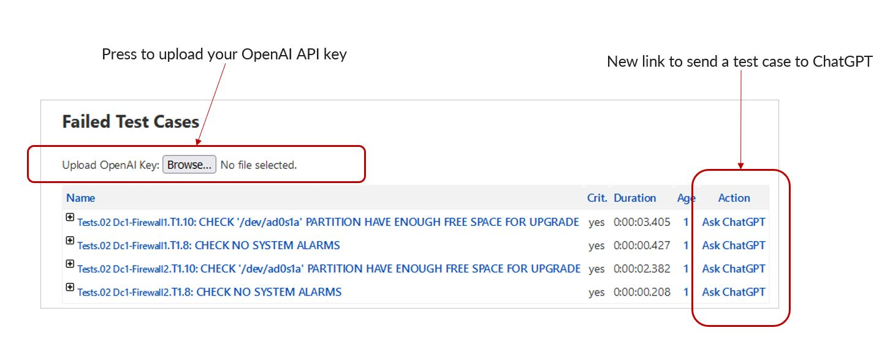
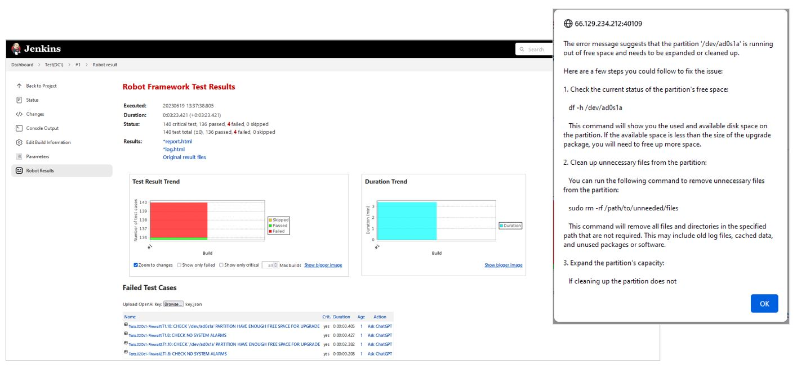

# AI Integration with Robot via Jenkins

This example enhancement to NITA uses an AI such as ChatGPT to help you figure out why certain test cases might have failed and what you can do to fix them. This can be incredibly useful for level 1 network operations staff, who might need an artificial assistant to help them investigate why a test may have failed. Note that you (or whoever runs the query) will also need an account with the AI 
[such as ChatGPT](https://platform.openai.com/signup?launch) for all of this to work.

## Overview

What we will do is modify the results page of Robot tests which Jenkins serves to us. Jenkins will summarise the failed test results at the top of the page, so all we need to do is add a way to pass the test case description to an AI. For this to work we need to add two new artifacts to the Jenkins UI, one is a button that we can use to upload an API key, URL and AI model to use, and the other is a hyperlink that we can use to trigger a call to the AI server. These two new artifacts will make the results page look like this:



Follow the steps described in this README to install and edit the files necessary to make this work...

## Step 1: The Robot Plugin Jar File

Refer to the [Creating Custom Containers](https://github.com/Juniper/nita/blob/main/docs/custom-containers.md) document for details on how to create a custom container for NITA. You can use the [Dockerfile](./Dockerfile) here to easily roll your own container.

## Step 2: Copy Example JavaScript Files

:bulb: Pro-Tip: The directory `/var/nita_project` on the host maps to `/project` in the Jenkins container, making it easy to move files between the host and the container.

Download the example JavaScript files provided in this repository ( and ) and save them on the NITA host machine in the `/var/nita_project` directory. Then, in the Jenkins container, create a directory `/var/jenkins_home/userContent/js` and copy them across. Like this:

```
$ cd /var/nita_project
$ wget https://raw.githubusercontent.com/Juniper/nita/main/examples/chatgpt/js/openai.js
$ wget https://raw.githubusercontent.com/Juniper/nita/main/examples/chatgpt/js/readfile.js
$ nita-cmd jenkins cli root
# mv /project/openai.js /var/jenkins_home/userContent/js
# mv /project/readfile.js /var/jenkins_home/userContent/js
# exit
```

You can either use the example Javascript files provided, or create your own, but they must go in the `/var/jenkins_home/userContent/js` directory in the Jenkins container.

:warning: Note that the  script permits a maximum of 400 tokens to be used in the exchange with AI, but you might want to adjust this to suit your needs and budget. Tokens are the currency commonly used by AI such as ChatGPT which you need to pay for - if you don't know what a token is, or how much it costs, check out the latest [OpenAI pricing page](https://openai.com/pricing) (for example).

## Step 3: Test It

Check for errors in the log as you access a page such as `https://<jenkins>:<port>/job/<test>/lastBuild/robot/#`. The next thing to do is to upload your API Key, URL and model in a file, which you do by pressing the `Browse...` button that is now on the page. The file must be JSON formatted, with the following fields like this:

``` js
{
  "OPENAI_API_KEY": "sk-xxxxxxxxxxxxxx",
  "OPENAI_BASE_URL": "https://<api url>",
  "OPENAI_MODEL": "<api model>"
}
```
If you don't know which URL or model to use you can leave them blank and NITA will default to using the following values for ChatGPT:

Object Name | Description
---|---
``OPENAI_API_KEY`` |  The API key. This is required, so if it is not provided the script will return ``false`` (i.e. fail to continue)
``OPENAI_BASE_URL`` | The URL of the API server. If this is not provided, the script will default to using ``https://api.openai.com/v1/chat/completions`` (ChatGPT)
``OPENAI_MODEL`` | The name of the Large Language Model to use. If this is not provided, the script will default to using ``gpt-3.5-turbo``


The key is required and the "xxxx" in the example above should be replaced with your actual API key! There is an example  file in this repo, which you can use as a template to edit. Then simply click on an "Ask AI" link alongside any particular failed test case that you want help with. Expect a delay of between 5-10 seconds whilst ChatGPT does its thing, and then a window will appear with some helpful suggestions, a bit like this:



And if nothing appears to be working, press `F12` in your browser to review the console output. Otherwise kick back, relax and admire your work. Well done!

## :warning: Cross Origin Resource Sharing

Note that the [openai.js](../openai/openai.js) script uses the ``XMLHttpRequest()`` JavaScript method to construct an API request that is sent to the server. Before sending an ``HTTP POST`` request, this method will send an ``OPTIONS`` request to the server first to verify that the server will allow the client to set the ``Authorization`` and ``Content-type`` fields in the header. This is standard industry practice, called "Cross-Origin Resource Sharing (CORS)" (see [mozilla.org](https://developer.mozilla.org/en-US/docs/Web/HTTP/CORS) and [Stack Overflow](https://stackoverflow.com/questions/15605823/why-is-httprequest-sending-the-options-verb-instead-of-post#15605935) for descriptions). However, for this to succeed, the remote API server must be configured to allow these fields to be set in the header. For example, if the API server is an Apache server, the following 3 lines must be included in the server configuration:

```bash
Header set Access-Control-Allow-Origin "*"
Header set Access-Control-Allow-Methods "GET,POST,OPTIONS"
Header set Access-Control-Allow-Headers "Authorization, Content-Type, Origin"
```
If the code fails during testing, and the browser console reports CORS errors, you will need to contact the administrators of the remote server and ask them to configure the CORS settings described here.
